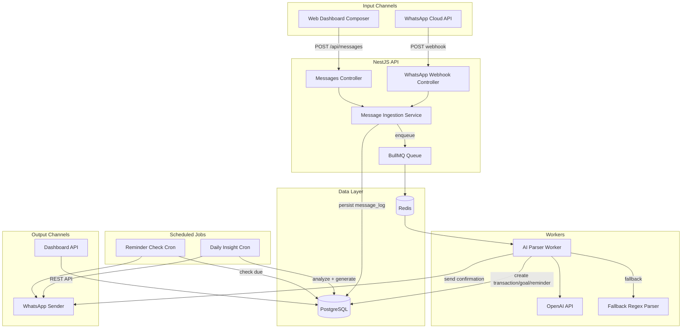

# MONETA MVP — Full Build Plan

## Project Structure

Simple monorepo with two apps (no Turborepo overhead for MVP):

```
moneta/
├── backend/                    # NestJS API
│   ├── prisma/
│   │   ├── schema.prisma
│   │   └── seed.ts
│   ├── src/
│   │   ├── app.module.ts
│   │   ├── main.ts
│   │   ├── common/
│   │   │   ├── config/         # env validation (Joi)
│   │   │   ├── guards/         # JwtAuthGuard, WhatsAppSignatureGuard
│   │   │   ├── filters/        # GlobalExceptionFilter
│   │   │   ├── interceptors/   # LoggingInterceptor
│   │   │   ├── decorators/     # @CurrentUser, @Public
│   │   │   └── dto/            # shared DTOs
│   │   ├── modules/
│   │   │   ├── auth/           # JWT + Magic Link (email OTP)
│   │   │   ├── users/          # User CRUD
│   │   │   ├── messages/       # Unified ingestion pipeline
│   │   │   ├── ai/             # OpenAI parser + fallback
│   │   │   ├── transactions/   # CRUD + filters
│   │   │   ├── categories/     # Auto-detected + editable
│   │   │   ├── goals/          # CRUD + progress + forecast
│   │   │   ├── reminders/      # CRUD + scheduler
│   │   │   ├── insights/       # Daily cron + storage
│   │   │   ├── forecast/       # End-of-month projection
│   │   │   ├── whatsapp/       # Meta Cloud API webhook + sender
│   │   │   └── queue/          # BullMQ setup + processors
│   │   └── prisma/             # PrismaModule + PrismaService
│   ├── test/
│   ├── .env.example
│   ├── nest-cli.json
│   ├── tsconfig.json
│   └── package.json
├── frontend/                   # Next.js 14 (App Router)
│   ├── src/
│   │   ├── app/
│   │   │   ├── (auth)/
│   │   │   │   ├── login/page.tsx
│   │   │   │   └── verify/page.tsx
│   │   │   ├── (dashboard)/
│   │   │   │   ├── layout.tsx        # responsive shell
│   │   │   │   ├── page.tsx          # main dashboard
│   │   │   │   ├── transactions/page.tsx
│   │   │   │   ├── goals/page.tsx
│   │   │   │   └── insights/page.tsx
│   │   │   ├── layout.tsx
│   │   │   └── globals.css
│   │   ├── components/
│   │   │   ├── ui/             # shadcn/ui primitives
│   │   │   ├── layout/         # Sidebar, BottomNav, TopBar
│   │   │   ├── dashboard/      # SummaryCards, Charts
│   │   │   ├── composer/       # MessageComposer, ParsedPreview, CorrectionForm
│   │   │   └── shared/         # LoadingStates, EmptyStates
│   │   ├── lib/
│   │   │   ├── api.ts          # typed fetch wrappers
│   │   │   ├── auth.ts         # token management
│   │   │   └── utils.ts
│   │   ├── hooks/
│   │   │   ├── use-auth.ts
│   │   │   ├── use-transactions.ts
│   │   │   └── use-composer.ts
│   │   └── middleware.ts       # route protection
│   ├── public/
│   ├── .env.example
│   ├── tailwind.config.ts
│   ├── next.config.js
│   └── package.json
├── docs/
│   ├── PRODUCT_STRATEGY.md
│   └── SYSTEM_DESIGN.md
├── .gitignore
└── README.md
```

---

## STEP 1 — Product and Growth Strategy

Create `docs/PRODUCT_STRATEGY.md` covering:

- **ICP**: Brazilian young professionals (22-35), gig workers, and couples managing joint expenses. Urban, mobile-first, already on WhatsApp daily.
- **Positioning**: "Sua assessora financeira no WhatsApp" — positioned as the accessible, conversational alternative to spreadsheet apps and expensive human financial advisors.
- **Pricing**: Free tier (30 transactions/month, basic insights) -> Pro R$19.90/month (unlimited transactions, daily AI coach, goals, forecasts). 14-day free trial of Pro.
- **Onboarding (first 5 minutes)**: Magic link login -> WhatsApp number linking -> First guided message ("Diga quanto ganhou este mes") -> Instant dashboard with first transaction.
- **Retention hooks**: Daily morning insight via WhatsApp, weekly spending summary, goal progress notifications, streak counter for daily logging.
- **North Star Metric**: Weekly Active Users who log at least 3 transactions per week.
- **KPIs**: DAU/MAU ratio, messages parsed/day, trial-to-paid conversion, D7/D30 retention.
- **Viral loops**: Shareable monthly summary card (image), invite-a-friend (both get 1 month Pro), couple mode (shared finances view).
- **Landing page copy outline**: Hero ("Controle suas financas pelo WhatsApp"), Social proof, How it works (3 steps), Dashboard preview, Pricing, CTA.

---

## STEP 2 — System Design

Create `docs/SYSTEM_DESIGN.md` with architecture diagrams and decisions.

### High-Level Architecture



### Key Design Decisions

- **Queue-first for webhooks**: WhatsApp webhook handler returns 200 immediately, enqueues job to BullMQ. Worker handles AI parsing, entity creation, and response.
- **Unified ingestion**: Both WhatsApp and Web messages go through the same `MessageIngestionService` which validates, persists `message_log`, and enqueues.
- **Idempotency**: Compound key `(userId, channelMessageId)` on `message_logs` prevents duplicate processing. WhatsApp uses Meta's message ID; Web generates a client-side UUID.
- **AI with fallback**: Primary path uses OpenAI function calling. If OpenAI fails or times out (3s), a regex-based fallback parser handles common patterns like "gastei X em Y".
- **Auth**: Magic link via email. Backend generates a 6-digit OTP, sends via email (Resend API for MVP), stores hashed token with 10-min expiry. On verification, issues JWT (access 15min + refresh 7d).
- **Rate limiting**: `@nestjs/throttler` on public endpoints (login, webhook). WhatsApp webhook additionally validates HMAC signature.

### Data Flows

**WhatsApp message flow**:

1. Meta sends POST to `/webhooks/whatsapp`
2. Guard validates HMAC-SHA256 signature
3. Controller extracts message text + sender phone
4. Looks up user by phone (or creates pending user)
5. Calls `MessageIngestionService.ingest()` -> persists `message_log` (status: PENDING)
6. Enqueues `{ messageLogId }` to `ai-parse` queue
7. Returns 200 to Meta
8. Worker picks up job -> calls OpenAI -> creates entity -> updates message_log (status: COMPLETED) -> sends WhatsApp confirmation

**Web composer flow**:

1. User types message in composer, clicks send
2. Frontend POSTs to `/api/messages` with JWT auth
3. Same `MessageIngestionService.ingest()` flow
4. Frontend polls or uses response to show parsed preview
5. User can edit parsed result before confirming
6. On confirm, frontend PATCHes the transaction/goal/reminder

---

## STEP 3 — Database Design (Prisma)

Full `prisma/schema.prisma` with these models:

- **User**: id, email, name, phone, whatsappVerified, timezone, createdAt, updatedAt
- **AuthSession**: id, userId, token (hashed), type (MAGIC_LINK/OTP), expiresAt, usedAt
- **RefreshToken**: id, userId, token (hashed), expiresAt, revokedAt
- **Category**: id, userId (nullable for defaults), name, icon, color, isDefault
- **Transaction**: id, userId, type (INCOME/EXPENSE), amount (Decimal), description, categoryId, date, messageLogId, createdAt, updatedAt
- **Goal**: id, userId, title, targetAmount, currentAmount, deadline, status (ACTIVE/COMPLETED/CANCELLED), messageLogId, createdAt, updatedAt
- **Reminder**: id, userId, title, amount (optional), recurrence (JSON: type + dayOfMonth/dayOfWeek), nextDueDate, isActive, messageLogId, createdAt, updatedAt
- **MessageLog**: id, idempotencyKey (unique), userId, channel (WHATSAPP/WEB), rawText, parsedAction (JSON), aiRawOutput (JSON), status (PENDING/PROCESSING/COMPLETED/FAILED), errorMessage, createdAt
- **AiInsight**: id, userId, type (DAILY_SUMMARY/SPENDING_ALERT/FORECAST/TIP), content (text), metadata (JSON), sentViaWhatsapp, createdAt

Key indexes: `MessageLog(idempotencyKey)` unique, `Transaction(userId, date)`, `Transaction(userId, categoryId)`, `Reminder(nextDueDate, isActive)`, `AiInsight(userId, createdAt)`.

---

## STEP 4 — Backend Code (NestJS)

### Module-by-module implementation:

**4.1 — Project scaffolding**: `nest new backend`, install deps (Prisma, BullMQ, @nestjs/bullmq, @nestjs/throttler, @nestjs/schedule, @nestjs/jwt, class-validator, class-transformer, ioredis, openai, axios, joi)

**4.2 — Config module**: Joi-validated env config for DATABASE_URL, REDIS_URL, JWT_SECRET, OPENAI_API_KEY, WHATSAPP_TOKEN, WHATSAPP_VERIFY_TOKEN, WHATSAPP_PHONE_NUMBER_ID, META_APP_SECRET, RESEND_API_KEY

**4.3 — Prisma module**: PrismaService extending OnModuleInit with connection management

**4.4 — Auth module**:

- `POST /auth/login` — accepts email, generates OTP, sends via Resend, stores hashed in AuthSession
- `POST /auth/verify` — accepts email + code, validates, issues JWT access + refresh tokens
- `POST /auth/refresh` — rotate refresh token
- JwtStrategy + JwtAuthGuard (global with @Public bypass)

**4.5 — Messages module** (unified ingestion):

- `POST /api/messages` — authenticated, accepts `{ text, idempotencyKey }`
- `WhatsAppWebhookController` — GET (verification) + POST (message handling)
- `WhatsAppSignatureGuard` — HMAC-SHA256 validation
- `MessageIngestionService.ingest(userId, channel, text, idempotencyKey)` — persist + enqueue

**4.6 — Queue module**:

- BullMQ setup with `ai-parse` queue
- `AiParseProcessor` (extends WorkerHost) — dequeues, calls AI service, creates entities, sends response
- Retry config: 3 attempts, exponential backoff

**4.7 — AI module**:

- `AiParserService.parse(text, userId)` — OpenAI function calling with 3 tools: `create_transaction`, `create_goal`, `create_reminder`
- System prompt in pt-BR with examples
- `FallbackParserService.parse(text)` — regex patterns for "gastei/paguei X", "recebi X", "meta X ate Y"
- Confidence scoring based on function call presence + amount detection

**4.8 — Transactions module**: CRUD with filters (month, category, type), monthly aggregation endpoints

**4.9 — Categories module**: Seed default categories (Alimentacao, Transporte, Moradia, Saude, Lazer, Educacao, Salario, Freelance, etc.), user can create custom

**4.10 — Goals module**: CRUD, progress calculation, forecast completion date based on average monthly savings rate

**4.11 — Reminders module**: CRUD, `@Cron` every hour checks `nextDueDate <= now`, sends WhatsApp, advances to next occurrence

**4.12 — Insights module**: `@Cron('0 8 * * *')` (8 AM daily) — for each user: analyze last 7 days spending, detect category spikes (>30% above average), generate end-of-month projection, compose pt-BR insight text, store in `ai_insights`, send via WhatsApp

**4.13 — Forecast service**: Calculate based on: (a) average daily spend rate from current month, (b) project remaining days, (c) compare projected total vs income. Output: projected end-of-month balance + risk date if negative.

**4.14 — WhatsApp sender service**: `WhatsAppService.sendText(phone, text)` using Meta Graph API v21.0

**4.15 — Global infrastructure**: ExceptionFilter (maps Prisma/validation/unknown errors), LoggingInterceptor (request/response timing), Sentry hook points (try/catch wrappers ready for `Sentry.captureException`)

---

## STEP 5 — AI Function Calling Parser

### OpenAI Setup

- Model: `gpt-4o-mini` (cost-efficient, good enough for structured extraction)
- Structured outputs with `strict: true`

### Function schemas:

**create_transaction**:

```json
{
  "type": "INCOME" | "EXPENSE",
  "amount": number,
  "description": string,
  "category": string,
  "date": string (ISO date, default today)
}
```

**create_goal**:

```json
{
  "title": string,
  "targetAmount": number,
  "deadline": string (ISO date)
}
```

**create_reminder**:

```json
{
  "title": string,
  "amount": number | null,
  "recurrenceType": "MONTHLY" | "WEEKLY" | "ONCE",
  "dayOfMonth": number | null,
  "dayOfWeek": number | null,
  "date": string | null
}
```

### System prompt (pt-BR):

Detailed system prompt with 10+ examples of Brazilian Portuguese financial messages, context about Brazilian currency (BRL), common payment methods (Pix, cartao, boleto), and instruction to always call one of the three tools.

### Fallback parser:

Regex-based patterns:

- `/(?:gastei|paguei|comprei)\s+(\d+(?:[.,]\d{2})?)\s*(?:no?|em|de)?\s*(.+)/i` -> EXPENSE
- `/(?:recebi|ganhei|entrou)\s+(\d+(?:[.,]\d{2})?)\s*(.+)?/i` -> INCOME
- `/(?:meta|objetivo|juntar)\s+(\d+(?:[.,]\d{2})?)\s*(?:ate|até)\s*(.+)/i` -> GOAL
- `/(?:pagar|lembrar|lembrete)\s+(.+?)(?:\s+(?:todo|dia)\s+(\d+))?/i` -> REMINDER

---

## STEP 6 — Frontend (Next.js 14)

### Setup

- `npx create-next-app@14 frontend --typescript --tailwind --app --src-dir`
- Install shadcn/ui CLI, init, add: Button, Card, Input, Sheet, Dialog, DropdownMenu, Select, Badge, Separator, Skeleton, Tabs, Avatar, ScrollArea
- Install Recharts, date-fns, lucide-react

### Responsive layout strategy

**Mobile (< 768px)**:

- Bottom navigation bar (5 items: Dashboard, Transacoes, Metas, Insights, Perfil)
- Stacked card layouts
- Full-width charts
- Floating message composer button (opens sheet from bottom)

**Tablet (768px-1024px)**:

- Collapsible sidebar
- 2-column grid for cards
- Side-by-side charts

**Desktop (> 1024px)**:

- Fixed sidebar navigation
- 3-4 column grid for summary cards
- Charts in 2-column layout
- Composer as persistent panel on right side

### Pages:

**Login page**: Email input + "Enviar codigo" button, clean minimal design
**Verify page**: 6-digit OTP input, auto-submit

**Dashboard (main)**:

- Summary cards row: Saldo do mes, Receitas, Despesas, Previsao fim do mes (with risk indicator color)
- Charts: Income vs Expenses (bar chart by week/month), Category breakdown (donut chart)
- Recent transactions (card list, not table)
- Quick message composer (sticky bottom on mobile, sidebar panel on desktop)

**Transactions page**:

- Filter bar: month picker, category dropdown, type toggle (all/income/expense)
- Transaction list as cards (swipe-to-edit on mobile concept, click-to-edit on desktop)
- Edit dialog: amount, category, date, description fields

**Goals page**:

- Goal cards with progress bar, current/target amounts, predicted completion date
- "Nova meta" button opens form

**Insights page**:

- Timeline of daily insights
- Each insight card with date, type badge, content text

### Message Composer Component (critical UX):

1. Chat-like input with send button at bottom
2. On submit: POST to `/api/messages`, show loading state
3. Show parsed preview card: detected type badge, amount, category, date, description
4. Correction UI: inline edit fields for each parsed field
5. "Confirmar" / "Corrigir" buttons
6. On confirm: optimistic update to transaction list, success toast
7. On correction: PATCH to update entity, then confirm

### API client layer:

- `lib/api.ts` with typed functions: `login()`, `verify()`, `sendMessage()`, `getTransactions()`, `getGoals()`, `getInsights()`, `getDashboardSummary()`, `updateTransaction()`, etc.
- Automatic JWT injection from cookie/localStorage
- 401 interceptor for refresh token flow

### Dark mode:

- shadcn/ui dark mode via `next-themes`
- Tailwind `darkMode: 'class'`
- Toggle in top bar

---

## STEP 7 — Deployment Guide

### Railway deployment (recommended for MVP):

- Create 4 services: Backend API, Frontend, PostgreSQL, Redis
- Backend: Dockerfile or Nixpacks auto-detect, set env vars
- Frontend: Nixpacks with Next.js auto-detect
- Prisma migrate on deploy via release command

### Environment variables (complete list):

Backend: DATABASE_URL, REDIS_URL, JWT_SECRET, JWT_REFRESH_SECRET, OPENAI_API_KEY, WHATSAPP_TOKEN, WHATSAPP_VERIFY_TOKEN, WHATSAPP_PHONE_NUMBER_ID, META_APP_SECRET, RESEND_API_KEY, FRONTEND_URL, PORT
Frontend: NEXT_PUBLIC_API_URL, NEXT_PUBLIC_APP_URL

### WhatsApp webhook setup:

- Meta Developer Console -> WhatsApp -> Configuration
- Callback URL: `https://api.moneta.app/webhooks/whatsapp`
- Verify token: matches WHATSAPP_VERIFY_TOKEN env var
- Subscribe to: messages

### Local dev:

- Docker compose for Postgres + Redis
- `cd backend && npm run start:dev`
- `cd frontend && npm run dev`

---

## Estimated File Count

- Backend: ~60 files (modules, services, controllers, DTOs, guards, decorators, config)
- Frontend: ~40 files (pages, components, hooks, lib, config)
- Infra/docs: ~10 files (docker-compose, env examples, docs, README)
- Total: ~110 files

## Implementation Order

The build will proceed strictly in the numbered step order. Within each step, files are created in dependency order (shared/config first, then core services, then controllers/pages).
